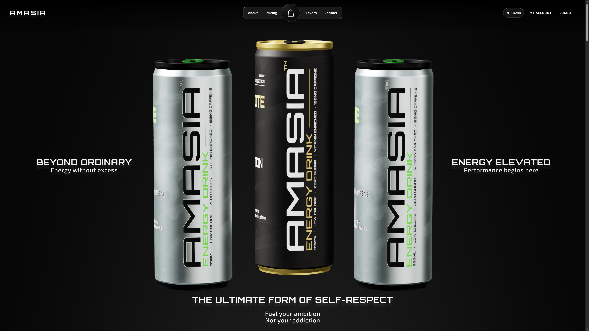
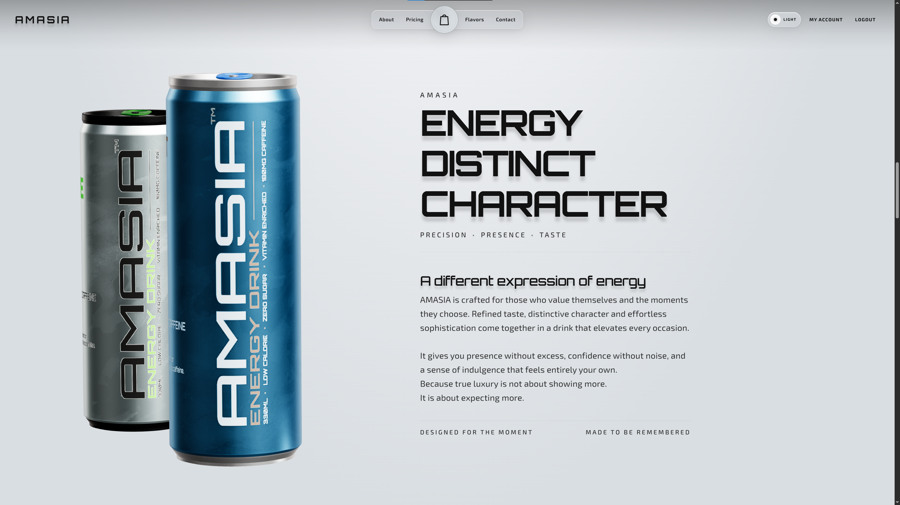
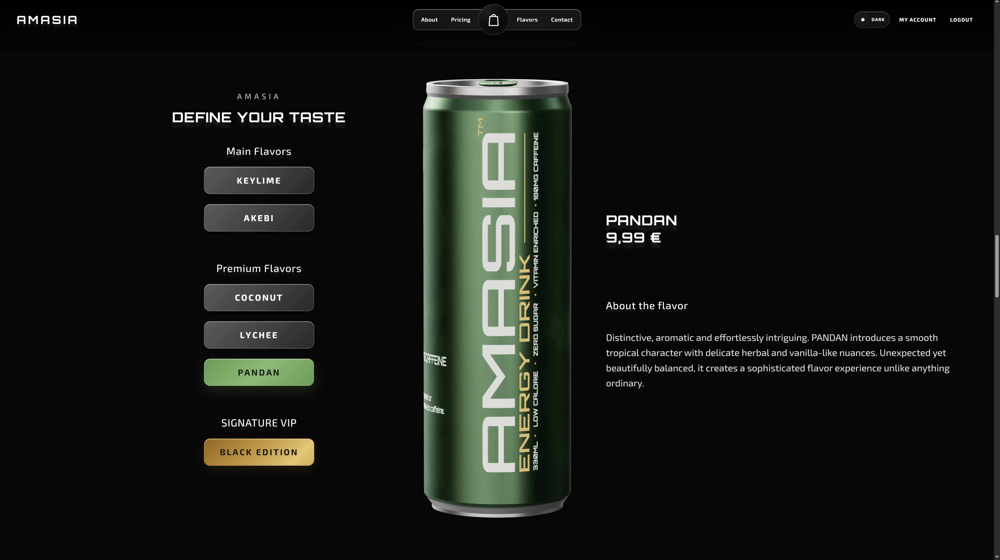
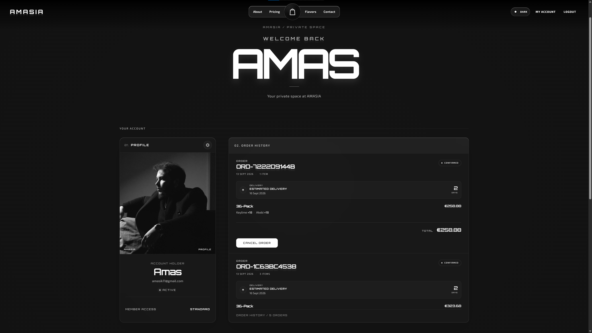
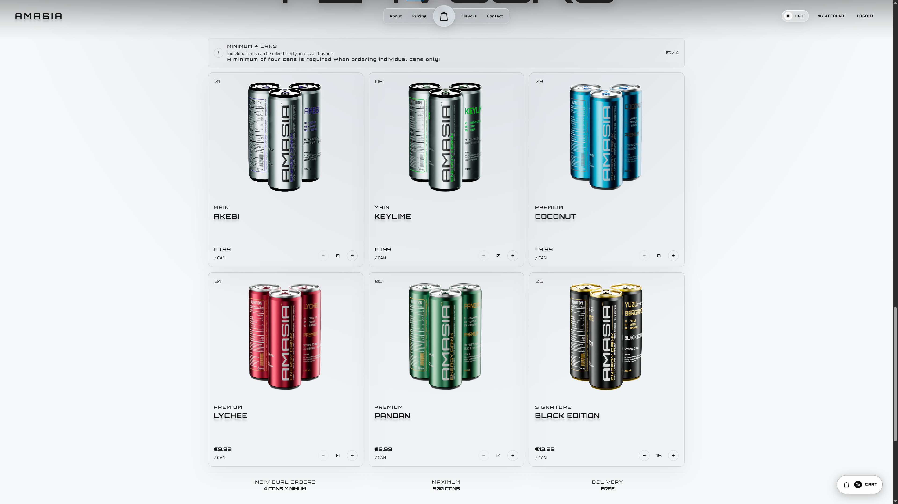

<h1 align="center">Hi, I'm Amas Movsisian</h1>

Full Stack Developer • Technical Designer • 3D Developer

Based in Dortmund, Germany

I build digital experiences where software engineering, visual design, and interactive 3D meet.

---

## About Me

I'm a **Full Stack Developer** with a professional background in **Media Design and Technical Design**. I combine software engineering, visual design, and interactive 3D to create modern web applications and digital experiences.

My work spans **frontend and backend development, REST APIs, UI/UX, WebGL, 3D, CGI, and VFX**. My design background allows me to approach development from both a technical and creative perspective, with a strong focus on functionality, performance, and user experience.

---

## Tech Stack

### Frontend

### Backend

### Tools & Development

---

# Main Project

## AMASIA

### Immersive 3D Luxury Energy Drink Experience

### Full Stack Production Project

  

<table>
  <tr>
    <td align="center" width="50%">
      
       <b>Immersive 3D Product Showcase</b>
    </td>
    <td align="center" width="50%">
      
       <b>Interactive Flavor Switching</b>
    </td>
  </tr>
  <tr>
    <td align="center" width="50%">
      
       <b>Account Dashboard and Order History</b>
    </td>
    <td align="center" width="50%">
      
       <b>Product Catalog and Commerce Flow</b>
    </td>
  </tr>
</table>

AMASIA is a fully self produced **Full Stack** digital experience for a premium energy drink brand, combining **Angular, TypeScript, Three.js, Django, Django REST Framework, 3D modeling, texturing, animation, and visual design**.

The project was developed from concept to implementation, including the visual identity, 3D assets, materials, animations, interactive web experience, and a complete production ready REST API backend.

Every part of the project was built as one continuous workflow: **brand identity, UI/UX, 3D modeling, PBR texturing, animation, rendering, frontend architecture, WebGL performance optimization, backend API design, JWT authentication, cart and checkout logic, database modeling, and production deployment.**

**Highlights:**

- Interactive real time 3D product visualization with Three.js.
- 360° product rotation with interactive flavor switching.
- Custom 3D models, materials, textures, and animations.
- Complete 3D production pipeline using Maya, Houdini, Substance Painter, and Photoshop.
- Custom Dark/Light mode with animated transitions.
- Responsive UI designed for desktop and mobile experiences.
- Combination of software engineering, UI/UX, 3D design, and visual storytelling.
- Full Stack integration with a dedicated Django REST API backend.
- JWT authentication with secure access and refresh token flow.
- Complete ordering pipeline with smart cart, discounted packs, and atomic checkout.
- Order history with simulated delivery status and cancellation handling.
- Backend deployed on an Ubuntu Linux server using Nginx and Gunicorn.
- Frontend hosted on GitHub Pages, consuming the deployed API.

**Live Demo**

https://amasia.amasmovsisian.com

**Repository**

https://github.com/AmasMovsisian/AmasiaInteractive3D

---

# Other Projects

## 01. Videoflix Backend API

### Video Streaming Platform Backend

Videoflix is a backend focused video streaming platform inspired by modern streaming services. The project provides a complete REST API for authentication, user management, video handling, transcoding, and adaptive video streaming.

**Highlights:**

- JWT authentication using HTTP only cookies.
- User registration with email verification.
- Complete password reset workflow.
- Secure authentication and authorization.
- Video upload and management.
- Automatic video transcoding using FFmpeg.
- Multiple video resolutions for adaptive streaming.
- HLS based video delivery.
- PostgreSQL for persistent data storage.
- Redis for caching and background processing.
- Dockerized development and deployment environment.
- Docker Compose for managing the application stack.

**Repository**

https://github.com/AmasMovsisian/Videoflix_Backend

---

## 02. Join

### Collaborative Kanban Task Management

A responsive Kanban task management application built with **Angular and Firebase**, designed around collaborative project and task management.

**Features:**

- User authentication.
- Real time data synchronization with Firebase.
- Task creation, editing, and organization.
- Kanban style workflow.
- Responsive interface for different screen sizes.
- Component based Angular architecture.

**Live Demo**

https://join.amasmovsisian.com

**Repository**

https://github.com/AmasMovsisian/Join

---

## 03. Coderr Backend API

### Freelance Marketplace REST API

A Django REST API for a freelance marketplace platform, focusing on **RESTful architecture, authentication, authorization, user management, and project workflows**.

**Features:**

- RESTful API architecture.
- User authentication and authorization.
- User profiles and account management.
- Project and offer management.
- API based communication between frontend and backend.
- Structured Django application architecture.

**Live Demo**

https://coderr.amasmovsisian.com

**Repository**

https://github.com/AmasMovsisian/Coderr_backend

---

## 04. El Pollo Loco

### Browser Based Jump & Run Game

A browser based Jump & Run game developed with **JavaScript, HTML, and SCSS**, using object oriented programming principles.

**Highlights:**

- Object oriented JavaScript architecture.
- Player movement and game mechanics.
- Collision detection.
- Enemy interactions.
- Game state management.
- Responsive browser based gameplay.

**Live Demo**

https://elpolloloco.amasmovsisian.com

**Repository**

https://github.com/AmasMovsisian/ElPolloLoco

---

# Core Interests

- Modern Full Stack Web Applications
- Interactive 3D & WebGL Experiences
- Software Architecture
- RESTful API Design
- Performance Optimization
- UI/UX & Interaction Design
- Creative Development
- CGI, VFX & Animation
- Clean and Maintainable Code

---

# Connect

---

<strong>Building software where engineering, creativity, and design meet.</strong>

